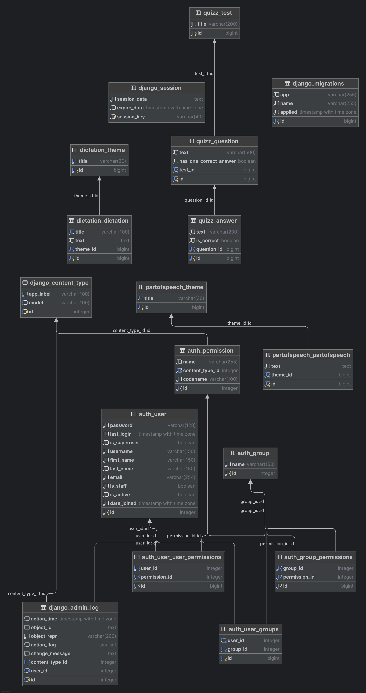

## Suncov 📚 

**Suncov** is a convenient and practical online textbook that gives you the opportunity to test tests on topics that interest you

---

## Table of Contents 📚

- [Installation and Setup](#installation-and-setup-)
  - [Requirements](#requirements)
  - [Environment Configuration](#environment-configuration-)
  - [Database](#database-)
  - [Static Files](#static-files-)
- [ER Diagram](#er-diagram-)
- [License](#license-)

---

## Installation and Setup 🚀

### Requirements

- Python 3.12+
- Docker
- Poetry (for dependency management)

### Installation and Setup

For detailed installation instructions, please refer to the [Installation Guide](docs/run-dev.md).

---

## ER Diagram 📊

Below is the ER diagram of the project's database:

---

## License 📜

This project is licensed under the MIT License. See the [LICENSE](LICENCE.md) file for details.